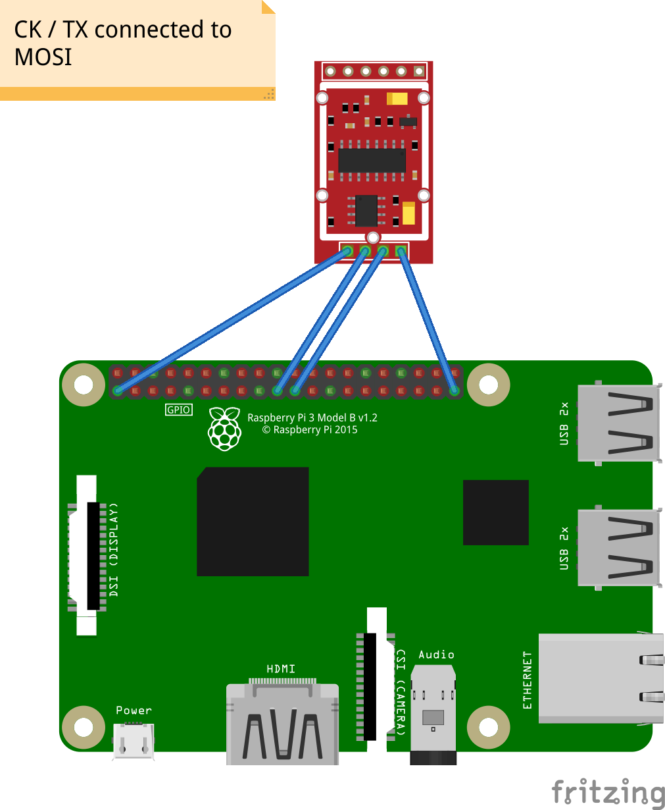

# hx711_spi

[](https://crates.io/crates/hx711_spi)

<!---->
<!---->

[](https://deps.rs/repo/github/crjeder/hx711_spi)


<!-- [](https://web.crev.dev/rust-reviews/crate/hx711_spi/)-->

This is a platform agnostic driver to interface with the HX711 load cell IC ([break out board by Sparkfun](https://github.com/sparkfun/HX711-Load-Cell-Amplifier)) It uses SPI instead of bit banging.
This `[no_std]` driver is built using [`embedded-hal`][2] traits.
It is developed on Raspberry PI and reported to work on STM32 and ESP32.
It is recommended to always use [cargo-crev](https://github.com/crev-dev/cargo-crev)
to verify the trustworthiness of each of your dependencies, including this one.

## Why did I write another HX711 driver?

In multi-user / multi-tasking environments bit banging is not reliable. SPI on the other hand handles the timing with hardware support and is not influenced by other processes. I found a few C implementations following the same idea: [1](https://github.com/dudapickler/hx711_SPI), [2](https://github.com/sash13/hx711_spi/tree/main) and [3](https://github.com/SIGSEGV111/hx711-spi-driver). For problems using bit banging, see e. g. [here](https://github.com/tatobari/hx711py)

## Usage

Note: I'm using the reddefined SPI signal names (['see sparkfun's Resolution'][3]).

Use an embedded-hal implementation to get SPI.
HX711 does not use SCLK, instead clock is provided by the driver using SDO. Make sure
that HX711 is the only device on the bus since it does not implemnt CS (Chip Select).
Connect the SDO to the PD_SCK and SDI to DOUT of the HX711. SPI clock frequency
has to be between 20 kHz and 5 MHz.
Since the SPI clock is not used, SPI mode 0 or mode 1 should work. You need
test which one gives the best results for you.
The library assumes that SDO signal is idle low. If this is not the case you have to use extra hardware to pull it low. In this case you should use the ```[invert-sdo]``` feature to send the correct signals to the hx711.

No scales functions (like tare weight and calibration) are implemented because I feel that's not part of a device driver.
Power down functions exist just for compatibility. Implementation is not possible with this (ab-) use of SPI since the CPU / MPU would need to constantly send on the bus to power donwn the HX711. This would totally defy the purpose.

## TODO

- Test on more platforms (HALs)
  - [x] Rasperry Pi
  - [x] STM32
  - [x] ESP32
  - [x] nrf52840  
  - [x] RP2040
  - [ ] Teensy
- [X] Power Save (functions exist just for compatibility. Implementation is not possible with SPI)
- [X] Reset
- [X] `[no_std]`
- [X] make it re-entrant / thread safe  
- [ ] validate against other libraries (bit banging, python, ..) 
- [X] async
- [X] use emedded HAL v1
- [ ] use compile-time dimensional analysis 

## Examples

### Raspberry PI

[](examples/hx711_spi.fzz)
```text

// embedded_hal implementation
use rppal::spi::{Bus, Error, Mode, SlaveSelect, Spi};

use hx711_spi::{Hx711, Hx711Error};

// minimal example
fn main() -> Result<(), Hx711Error<Error>> {
    let spi = Spi::new(Bus::Spi0, SlaveSelect::Ss0, 1_000_000, Mode::Mode1)?;
    let mut hx711 = Hx711::new(spi);

    hx711.reset()?;
    let v = hx711.read();
    println!("value = {:?}", v);

    Ok(())
}
```

### STM32F1

An example stm32f103 (blue pill) initialization (note mode 1).

```text
    use stm32f1xx_hal::time::U32Ext;
    use cortex_m_rt::entry;
    use stm32f1xx_hal::{pac, prelude::*,
      spi::{Mode, Phase, Polarity, Spi}, };

    let dp = pac::Peripherals::take().unwrap();
    let mut rcc = dp.RCC.constrain();
    let mut gpiob = dp.GPIOB.split(&mut rcc.apb2);
    let clocks = rcc.cfgr.freeze(&mut flash.acr);

    let hx711_spi_pins = (
        gpiob.pb13.into_alternate_push_pull(&mut gpiob.crh),
        gpiob.pb14.into_floating_input(&mut gpiob.crh),
        gpiob.pb15.into_alternate_push_pull(&mut gpiob.crh),
    );
    let hx711_spi = spi::Spi::spi2(device.SPI2, hx711_spi_pins, spi::MODE_1, 1.mhz(), clocks);
    let mut hx711_sensor = Hx711::new(hx711_spi);
    hx711_sensor.reset().unwrap();
    hx711_sensor.set_mode(hx711_spi::Mode::ChAGain128).unwrap(); // x128 works up to +-20mV
```

## Roadmap

I wanted to use ```embedded_hal::adc::OneShot``` once it is finalized (was planed for embedded_hal 1.0). 
OneShot is not part of the released embedded_hal 1.0.0 and probably is gone forever. But now as it's out I'll port my code to it. The main challenge is async...

## Feedback

All kind of feedback is welcome. If you have questions or problems, please post them on the issue tracker
This is literally the first code I ever wrote in rust. I am still learning. So please be patient, it might take me some time to fix a bug. I may have to break my knowledge sound-barrier.
If you have tested on another platform I'd like to hear about that, too!

Big thanx to ['jbit'](https://github.com/jbit) for clearing the question about thread safety
and ['anddreyk0'](https://github.com/andreyk0) for testing on STM32 and both for debugging!

## References

- [datasheet][1]

[1]: https://cdn.sparkfun.com/datasheets/Sensors/ForceFlex/hx711_english.pdf

- [embedded-hal][2]

[2]: https://github.com/rust-embedded/embedded-hal

- [spi_signal_names][3]

[3]: https://www.sparkfun.com/spi_signal_names

## Licenses

# License
This software is licensed under either of

- Apache License, Version 2.0 ([LICENSE-APACHE](LICENSE-APACHE) or
  [here](http://www.apache.org/licenses/LICENSE-2.0))
- MIT license ([LICENSE-MIT](LICENSE-MIT) or [here](http://opensource.org/licenses/MIT))

at your option.

# Dependent Liceses

Copyright © 1991-2016 Unicode, Inc. All rights reserved. Distributed under the Terms of Use in http://www.unicode.org/copyright.html.

Permission is hereby granted, free of charge, to any person obtaining a copy of this software and associated documentation files (the " Software"), to deal in the Software without restriction, including without limitation the rights to use, copy, modify, merge, publish, distribute, sublicense, and/or sell copies of the Software, and to permit persons to whom the Software is furnished to do so, subject to the following conditions:

MIT License

The above copyright notice and this permission notice (including the next paragraph) shall be included in all copies or substantial portions of the Software.

THE SOFTWARE IS PROVIDED "AS IS", WITHOUT WARRANTY OF ANY KIND, EXPRESS OR IMPLIED, INCLUDING BUT NOT LIMITED TO THE WARRANTIES OF MERCHANTABILITY, FITNESS FOR A PARTICULAR PURPOSE AND NONINFRINGEMENT. IN NO EVENT SHALL THE AUTHORS OR COPYRIGHT HOLDERS BE LIABLE FOR ANY CLAIM, DAMAGES OR OTHER LIABILITY, WHETHER IN AN ACTION OF CONTRACT, TORT OR OTHERWISE, ARISING FROM, OUT OF OR IN CONNECTION WITH THE SOFTWARE OR THE USE OR OTHER DEALINGS IN THE SOFTWARE.

Mozilla Public License 2.0

This Source Code Form is subject to the terms of the Mozilla Public License, v. 2.0. If a copy of the MPL was not distributed with this file, You can obtain one at https://mozilla.org/MPL/2.0/.

If it is not possible or desirable to put the notice in a particular file, then You may include the notice in a location (such as a LICENSE file in a relevant directory) where a recipient would be likely to look for such a notice.

You may add additional accurate notices of copyright ownership.
